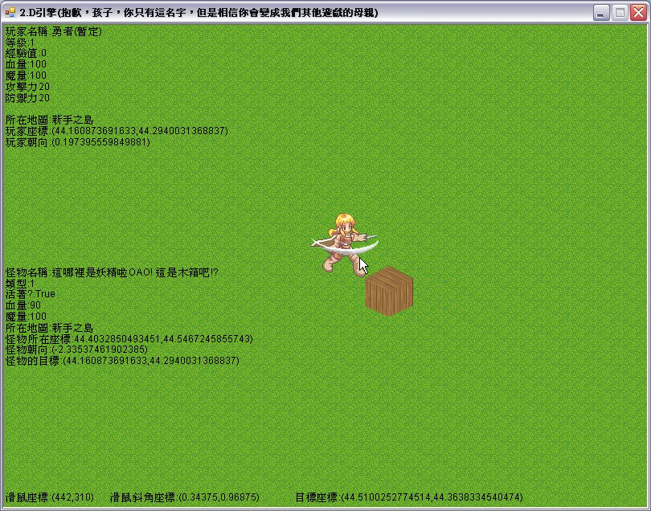
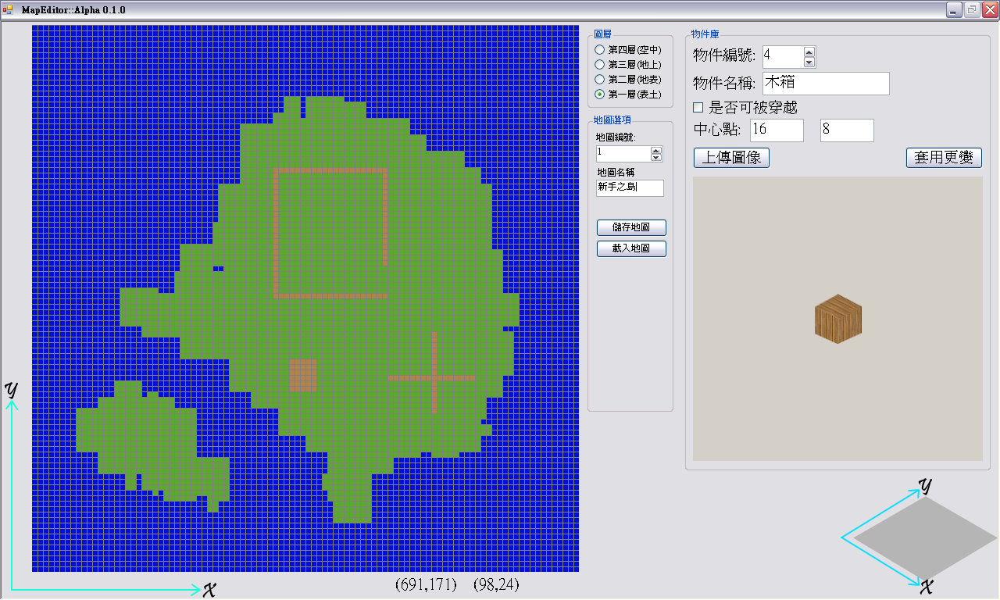

Simple 2.5D RPG Game
===
This side project was written when I was senior (industrial) vocational high school student in 2015, and I don't use VB.NET any more, so there are not been refactoring, which the code been a bit of messing up and not document or build guide.

### Game

### Map editor

### Materials
The image materials of character are modified from the book:
> 「3D RPG角色扮演遊戲程式設計：完整實例與經驗分享」
> Author: 坂本 千尋
> Translator: 博碩文化
> publishing house: 博碩文化

And some image materials are modified from RPG Maker XP RTP.